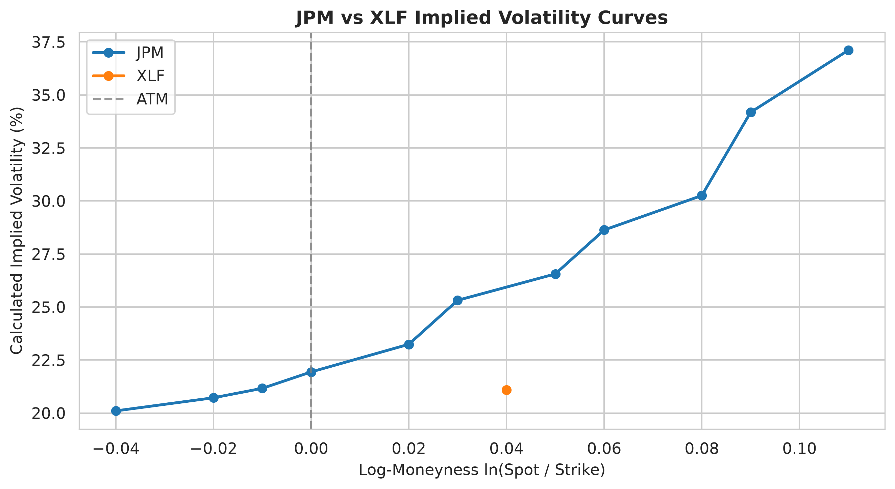
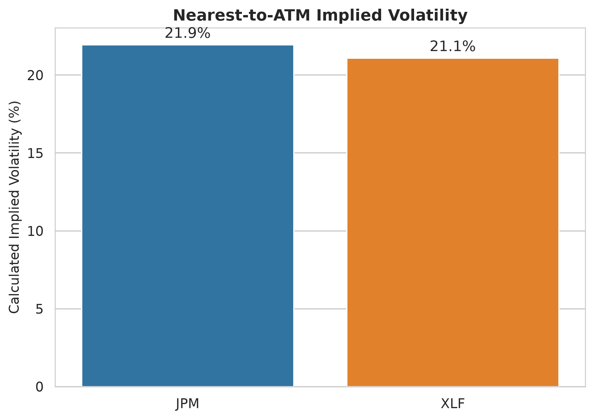
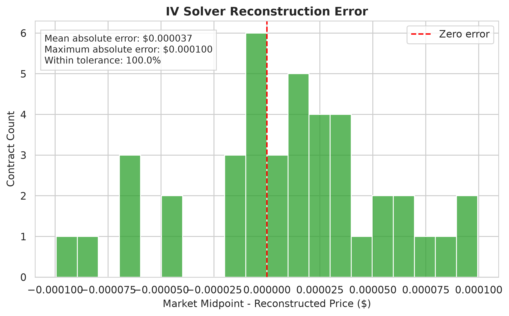
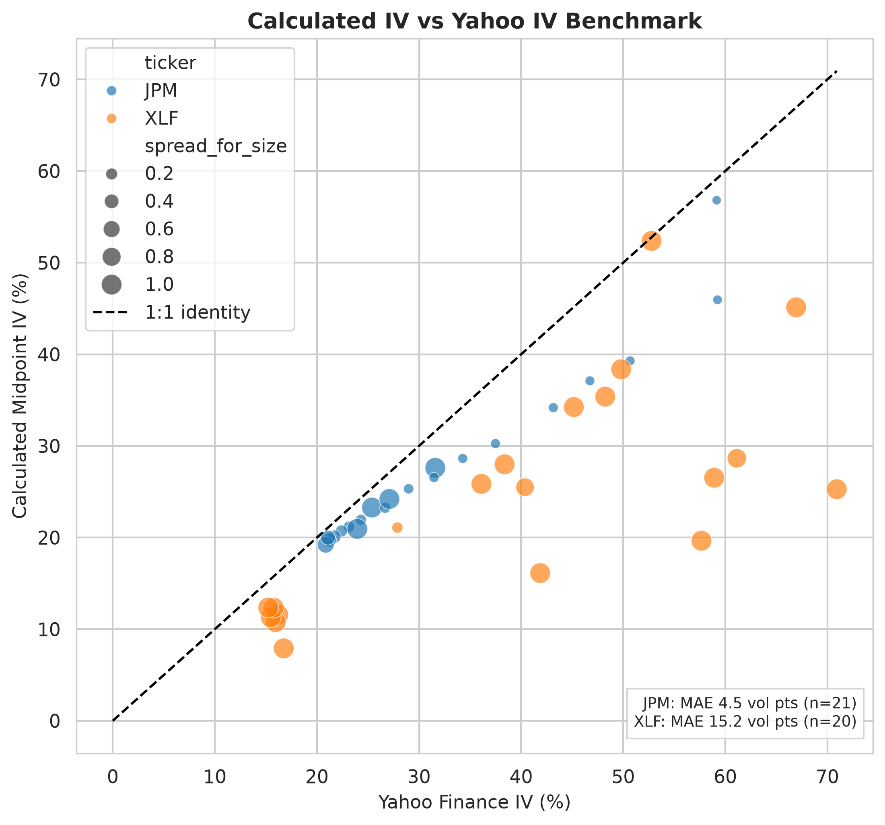
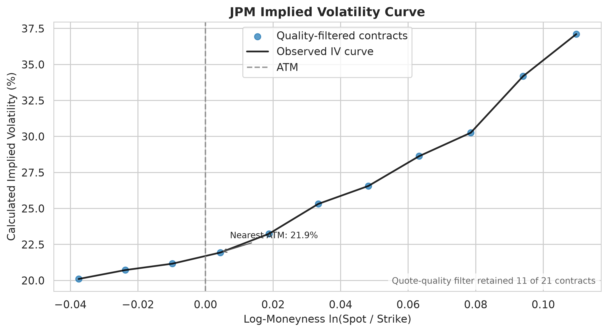
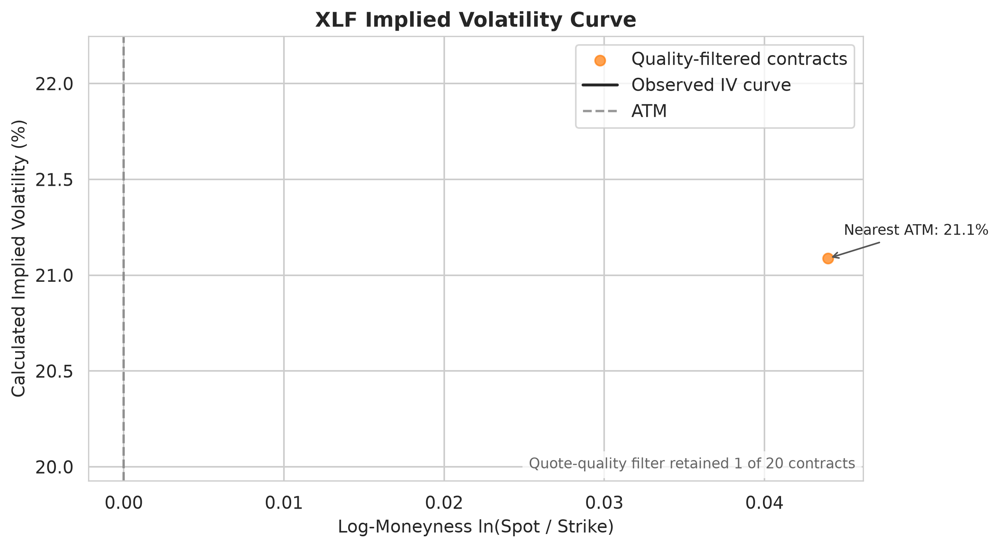

# Options Implied Volatility Analysis

A Python and SQLite pipeline that turns live option quotes into validated implied-volatility curves for **JPMorgan Chase (JPM)** and the **Financial Select Sector SPDR Fund (XLF)**.

The project retrieves option chains, selects a practical maturity, checks quote quality, estimates midpoint-implied volatility with a custom solver, stores each stage in a database, and produces charts comparing a single financial company with a diversified financial-sector ETF.

> **Project status:** Portfolio-ready pipeline. The current charts describe a live market snapshot. The VIX-regime framework is implemented for future analysis as daily observations accumulate.

---

## Why I Built This

The project explores a straightforward question:

> How do the level and shape of implied volatility for a single financial company differ from those of a diversified financial-sector ETF?

It also tests whether a custom implied-volatility solver can reliably reproduce observed option midpoints and examines where midpoint-based estimates differ from Yahoo Finance's published implied volatility.

The goal is not to claim a trading signal from one snapshot. The goal is to build a transparent and reusable research process that handles market data, model assumptions, validation, storage, and presentation carefully.

---

## What the Pipeline Does

1. **Fetches live data** for the two instruments configured in `src/config.py`.
2. **Selects an expiry between 20 and 45 days** instead of automatically using the nearest expiry.
3. **Calculates option midpoints** from quoted bids and asks.
4. **Checks quote quality** and removes invalid, crossed, duplicate, or expired records.
5. **Fetches a short-term rate proxy** from `^IRX` and estimates each instrument's trailing dividend yield.
6. **Prices calls** with a dividend-adjusted Black-Scholes model.
7. **Solves implied volatility** using a custom bisection algorithm.
8. **Reconstructs the market midpoint** to test numerical convergence.
9. **Stores raw, cleaned, analytical, and research outputs** in SQLite.
10. **Tags each snapshot with a VIX regime** using the latest available VIX close.
11. **Creates quote-quality-filtered charts** and suppresses regime comparisons when the data cannot support them.

```text
Yahoo Finance option chains
        |
        v
20-45 DTE expiry selection
        |
        v
Raw quote validation and SQLite storage
        |
        v
Dividend-adjusted Black-Scholes pricing
        |
        v
Custom bisection implied-volatility solver
        |
        v
Price reconstruction and analytical validation
        |
        v
VIX regime tagging and research summaries
        |
        v
Quality-filtered charts and comparisons
```

---

## Key Features

### Dynamic instrument configuration

The research pair is controlled in one place:

```python
PRIMARY_INSTRUMENT = {
    "ticker": "JPM",
    "name": "JPMorgan Chase",
    "description": "single financial institution",
}

COMPARISON_INSTRUMENT = {
    "ticker": "XLF",
    "name": "Financial Select Sector SPDR Fund",
    "description": "diversified financial-sector ETF",
}
```

For another Yahoo-supported stock or ETF pair, update these two dictionaries. Data retrieval, chart labels, filenames, colours, and database cleanup logic update automatically.

### Practical expiry selection

The original nearest-expiry approach produced unstable contracts with very little time value. The final pipeline selects the nearest expiry inside a **20-45 day window**, with a positive-DTE fallback when no preferred expiry is available.

### Dividend-adjusted pricing

The project uses a Black-Scholes call model with a continuous dividend-yield approximation:

```text
d1 = [ln(S/K) + (r - q + 0.5 * sigma^2) * T] / (sigma * sqrt(T))
d2 = d1 - sigma * sqrt(T)
Call = S * exp(-qT) * N(d1) - K * exp(-rT) * N(d2)
```

- `r` is a short-term Treasury proxy fetched from `^IRX`, with a configurable fallback.
- `q` is estimated from trailing 12-month cash dividends divided by the current underlying price.

### Custom implied-volatility solver

The bisection solver searches for the volatility that reproduces the option's bid-ask midpoint.

The solver:

- Uses a discounted no-arbitrage lower bound.
- Searches between 0% and 500% annualized volatility.
- Stops when pricing error is within the configured tolerance.
- Returns `NaN` instead of an unverified value when a solution cannot be found.

### Solver reconstruction test

Every calculated IV is passed back through the same pricing model using the same spot, strike, time, rate, and dividend inputs. The reconstructed price is compared with the original midpoint.

This verifies **numerical convergence**. It does not prove that Black-Scholes is a perfect model of the actual market contract.

### Quote-quality controls

All valid analytical observations remain in the database, but research charts use tighter filters so thin quotes are not presented as reliable market signals.

Default chart filters include:

- Positive bid
- Midpoint of at least `$0.10`
- Relative bid-ask spread of no more than `30%`
- Central log-moneyness range
- Calculated IV between `1%` and `100%`

The retained sample size is displayed on the individual volatility-curve charts.

### Safe reruns and schema upgrades

The database layer:

- Removes overlapping recent snapshots before reinserting.
- Replaces same-day regime summaries without a primary-key error.
- Adds newly required analytical columns to older local databases automatically.

---

## Research Questions and Current Results

The charts below are based on the latest live snapshot generated by the pipeline. They are descriptive results, not long-term statistical conclusions.

### 1. How do the JPM and XLF implied-volatility curves differ?

The comparison chart places both instruments on the same log-moneyness scale.

JPM represents the volatility of a single financial institution, while XLF reflects a diversified portfolio of financial companies. Differences in curve level and shape may reflect company-specific risk, diversification, liquidity, and differences in the available strike grid.

Only contracts that pass the visualization quality controls are included. These controls consider relative bid-ask spread, midpoint value, positive bid, moneyness, and calculated IV.



This chart represents one selected expiry and one market snapshot. It should not be interpreted as evidence that the same relationship holds across time or market regimes.

### 2. Which instrument has higher near-the-money implied volatility?

Nearest-to-ATM IV provides a cleaner central-volatility measure than averaging implied volatility across every strike.



This comparison answers a narrow question: which instrument had higher midpoint-implied volatility near the current underlying price in the selected expiry at the time of the snapshot?

### 3. Did the custom implied-volatility solver converge accurately?

Each calculated IV is passed back through the same dividend-adjusted Black-Scholes model using the same spot price, strike, time to expiry, risk-free rate, and dividend yield.

The difference between the original option midpoint and the reconstructed price measures the numerical precision of the solver.



Small reconstruction errors show that the bisection algorithm accurately reproduced the selected midpoint. This validates the numerical solver, not every assumption of the Black-Scholes model.

### 4. How does midpoint-implied IV compare with Yahoo Finance IV?

The project calculates IV using the current bid-ask midpoint and the project's rate and dividend assumptions. Yahoo Finance may use a different price, timestamp, interest rate, dividend treatment, exercise convention, or smoothing method.



Points close to the identity line indicate similar estimates. Larger gaps are best interpreted alongside quote quality, particularly the relative bid-ask spread represented by marker size.

This chart should not be interpreted as evidence that either estimate is universally more accurate.

<details>
<summary><strong>View the individual implied-volatility curves</strong></summary>

### JPM implied-volatility curve



### XLF implied-volatility curve



</details>

---

## Other Generated Output

The pipeline also creates a ticker-level pricing-difference chart:

```text
plots/pricing_difference_by_ticker.png
```

This chart compares each observed midpoint with the model price produced using Yahoo IV under the project's rate and dividend assumptions. It is retained as a diagnostic rather than featured as a primary research conclusion.

Regime-comparison charts are intentionally skipped until at least two real VIX regimes are available.

---

## Project Structure

```text
Options-IV-Analysis/
├── src/
│   ├── main.py
│   ├── config.py
│   ├── market_data.py
│   ├── data_validation.py
│   ├── black_scholes.py
│   ├── implied_volatility.py
│   ├── analytics.py
│   ├── analytics_validation.py
│   ├── database_manager.py
│   ├── regime_analysis.py
│   ├── visualization.py
│   └── utils.py
├── tests/
│   └── test_models.py
├── database/
│   └── .gitkeep
├── plots/
│   ├── jpm_volatility_curve.png
│   ├── xlf_volatility_curve.png
│   ├── jpm_vs_xlf_iv_curves.png
│   ├── atm_iv_jpm_vs_xlf.png
│   ├── calculated_vs_yahoo_iv.png
│   ├── pricing_difference_by_ticker.png
│   ├── iv_reconstruction_error.png
│   └── .gitkeep
├── requirements.txt
├── .gitignore
└── README.md
```

### Module responsibilities

- `main.py`: Runs the end-to-end workflow.
- `config.py`: Stores instruments, paths, model inputs, and filtering thresholds.
- `market_data.py`: Retrieves spot prices, option chains, expiries, rates, and dividends.
- `data_validation.py`: Checks and cleans raw quotes.
- `black_scholes.py`: Implements dividend-adjusted call pricing.
- `implied_volatility.py`: Implements the bisection IV solver.
- `analytics.py`: Creates pricing errors, IV differences, spreads, and moneyness features.
- `analytics_validation.py`: Drops hard numerical failures and reports diagnostics.
- `database_manager.py`: Creates, upgrades, saves, and queries SQLite tables.
- `regime_analysis.py`: Assigns VIX regimes and creates research summaries.
- `visualization.py`: Produces supported research and validation charts.
- `utils.py`: Provides shared validation, filtering, and figure-saving helpers.

---

## Installation

### 1. Clone the repository

```bash
git clone https://github.com/NirmayT/Options-IV-Analysis.git
cd Options-IV-Analysis
```

### 2. Create a virtual environment

```bash
python -m venv venv
```

Activate it on Windows PowerShell:

```powershell
venv\Scripts\Activate.ps1
```

Activate it on macOS or Linux:

```bash
source venv/bin/activate
```

### 3. Install the project requirements

```bash
pip install -r requirements.txt
```

The complete dependency list is maintained in `requirements.txt` rather than duplicated in the README.

---

## Usage

Run the automated tests first:

```bash
pytest -q
```

Delete old generated charts so stale files are not confused with current output.

Windows PowerShell:

```powershell
Remove-Item plots\*.png -ErrorAction SilentlyContinue
```

macOS or Linux:

```bash
rm -f plots/*.png
```

Run the full pipeline from the repository root:

```bash
python src/main.py
```

A successful run ends with:

```text
PIPELINE COMPLETED SUCCESSFULLY
```

The generated SQLite database is stored locally in `database/options.db`, and charts are written to `plots/`.

---

## Tests

The included test suite checks that:

- A dividend yield lowers a call's model value.
- The bisection solver recovers a known volatility from a model-generated price.
- An impossible option price returns `NaN` instead of a misleading result.

Run:

```bash
pytest -q
```

Expected result:

```text
3 passed
```

---

## Limitations

- JPM and XLF options are American-style contracts, while the project uses European Black-Scholes as a transparent approximation.
- The model uses a trailing dividend-yield estimate rather than expected discrete dividends before expiry.
- `^IRX` is a short-term Treasury proxy, not a maturity-matched continuously compounded zero rate.
- Yahoo spot prices, option quotes, and published IV may not be perfectly synchronized.
- Midpoint prices may not be directly executable, particularly when bid-ask spreads are wide.
- Each run uses one selected expiry, so the project does not estimate a full volatility term structure or surface.
- Current results describe a live snapshot. The VIX regime framework requires observations collected across multiple dates and regimes before supporting regime-level conclusions.
- The current research curves use calls only. A market-standard downside-skew study would also include out-of-the-money puts.
- Chart-quality thresholds are judgement calls and may affect which contracts are displayed.

---

## Planned Improvements

- Calculate bid, midpoint, and ask IV to display quote uncertainty bands.
- Add out-of-the-money puts below spot and calls above spot.
- Collect snapshots at a consistent time each trading day.
- Compare European Black-Scholes with an American binomial pricing model.
- Add multiple standardized expiries to study the volatility term structure.
- Run sensitivity analysis across different quote-quality thresholds.

---

## Technology

- Python
- NumPy and pandas
- SciPy
- yfinance
- SQLAlchemy and SQLite
- Matplotlib and Seaborn
- pytest

---

## Disclaimer

This project is for educational and research purposes only. It is not investment advice or a production pricing system. Market data may be delayed, incomplete, or based on conventions that differ from the assumptions used in this project.
